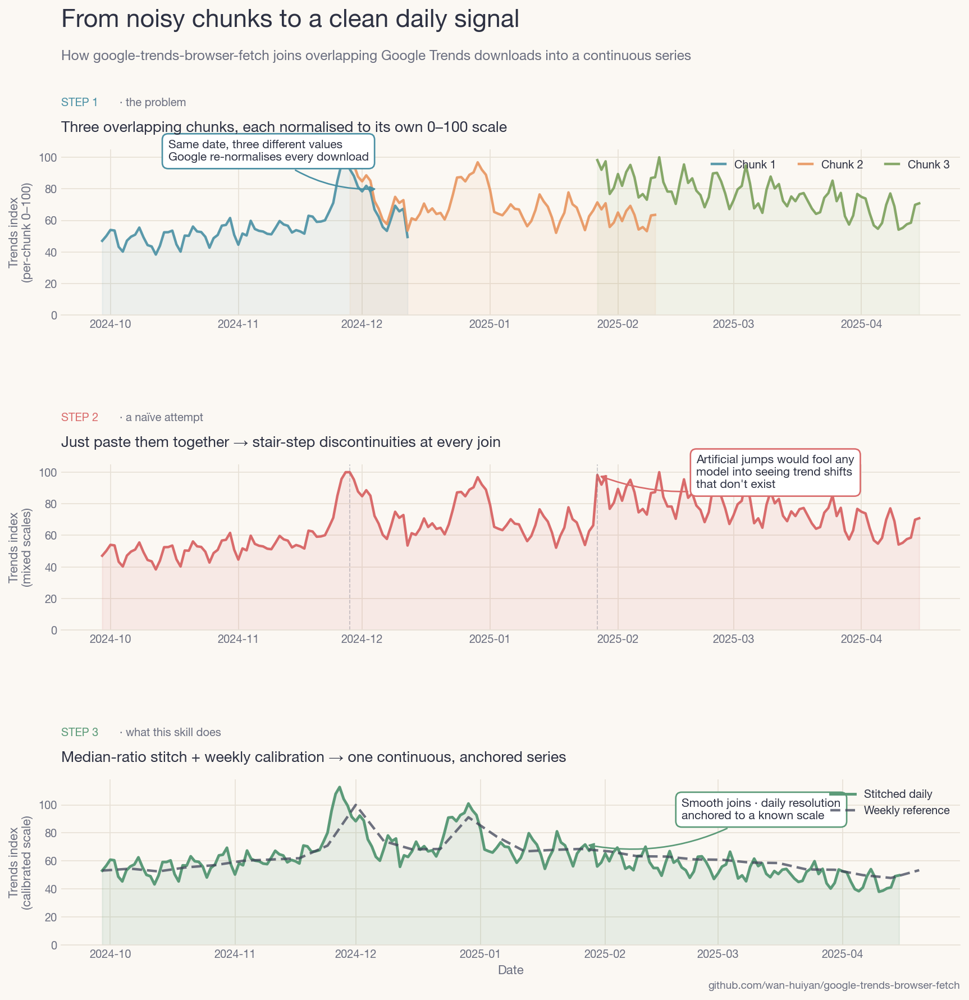

# google-trends-browser-fetch

Fetch Google Trends data via browser automation, with multi-chunk daily-resolution stitching for date ranges longer than 90 days.

[](https://github.com/wan-huiyan/google-trends-browser-fetch/releases)
[](LICENSE)
[](https://github.com/wan-huiyan/google-trends-browser-fetch/commits)
[](https://www.python.org/)
[](https://claude.com/claude-code)



The panel above shows the problem this skill solves. Google Trends normalises every query to 0–100 within its own date range, so downloading overlapping chunks gives you the *same day* at *different values* (top). Naïve concatenation produces stair-step discontinuities that break any downstream model (middle). The skill's median-ratio stitching + weekly calibration produces a continuous daily series anchored to a known reference scale (bottom).

## Why this skill exists

Two facts that aren't obvious until you hit them:

1. **`pytrends` is archived.** The community Python library was archived in April 2025 after Google tightened anti-scraping. The official Google Trends API launched July 2025 is gated alpha. For most users, **browser-driven CSV export is the only reliable path** as of April 2026.
2. **Google Trends silently downgrades to weekly for long ranges.** Anything ≥ 90 days returns weekly. To get daily over, say, 18 months, you have to download overlapping ~75-day chunks and stitch them — which is fiddly because each chunk has its own independent 0–100 normalisation.

This skill codifies both: the browser workflow (with three compatibility paths) and the stitching algorithm.

## ⚠️ One-time Chrome setup before first multi-chunk fetch

Chrome blocks the 2nd download from a site by default. Without this change, only the first chunk arrives and the rest silently fail. Flip this once:

**Chrome → Settings → Privacy and security → Site settings → Additional permissions → Automatic downloads →** select **"Sites can ask to automatically download multiple files"**.

Or, tighter: the first time Chrome blocks a download you'll see a small icon in the URL bar — click it and choose "Always allow trends.google.com to download multiple files".

This applies to all three compatibility paths below.

## Quick start

```
You: I need Google Trends data for "nike" and "running shoes" in the UK,
     daily resolution, from Sep 2024 to Mar 2026, for a BSTS model.

Claude: (invokes google-trends-browser-fetch)
        → Plans 9 overlapping 75-day chunks + 1 weekly reference
        → Drives Chrome to download all 10 CSVs
        → Runs stitch_daily.py (median-ratio + weekly calibration)
        → Writes data/trends_daily.csv + data/trends_daily.provenance.md
        → Reports: stitching std=0.03, daily-weekly r=0.66 ✓
```

## Installation

### Claude Code

```bash
# Plugin install (recommended)
/plugin marketplace add wan-huiyan/google-trends-browser-fetch
/plugin install google-trends-browser-fetch@wan-huiyan-google-trends-browser-fetch

# Or clone directly
git clone https://github.com/wan-huiyan/google-trends-browser-fetch.git \
  ~/.claude/skills/google-trends-browser-fetch
```

### Cursor / other IDEs

Cursor doesn't have Anthropic's Claude-in-Chrome extension, but a generic browser MCP fills the gap. Full setup in ~5 minutes:

**1. Clone the skill:**
```bash
git clone https://github.com/wan-huiyan/google-trends-browser-fetch.git \
  ~/.cursor/skills/google-trends-browser-fetch
```

**2. Install a browser MCP** (pick one):

- **Recommended: [Browser MCP](https://browsermcp.io/)** — uses your signed-in Chrome session, so Google Trends rate limits don't bite on multi-chunk fetches.
  1. Install the [Browser MCP Chrome extension](https://chromewebstore.google.com/detail/browser-mcp-automate-your/bjfgambnhccakkhmkepdoekmckoijdlc)
  2. Add to `.cursor/mcp.json` (or via `Cursor Settings → Tools → New MCP Server`):
     ```json
     {
       "mcpServers": {
         "browsermcp": {
           "command": "npx",
           "args": ["@browsermcp/mcp@latest"]
         }
       }
     }
     ```
  3. Open the extension popup → click **Connect** once to bind it to the MCP server.

- **Alternative: [chrome-devtools-mcp](https://github.com/ChromeDevTools/chrome-devtools-mcp)** — no extension required (launches its own Chrome via Puppeteer). Anonymous session means you'll hit Trends rate limits faster on 5+ chunk fetches. Config:
   ```json
   {
     "mcpServers": {
       "chrome-devtools": {
         "command": "npx",
         "args": ["-y", "chrome-devtools-mcp@latest"]
       }
     }
   }
   ```

**3. Restart Cursor** and ask it to fetch Trends data — it'll pick up the skill and drive the browser through whichever MCP you installed. The stitching scripts (`plan_chunks.py`, `stitch_daily.py`) are pure Python and work identically regardless of which browser-automation path you chose.

## Compatibility

Browser automation has environmental constraints. The skill supports three paths — pick whichever matches your setup.

| Path | Works with | Requires |
|---|---|---|
| **Claude in Chrome** (Anthropic-first-party) | Claude Code CLI (`claude --chrome`), VS Code ext, Claude desktop app | Pro / Max / Team / Enterprise plan (NOT API credits, NOT Bedrock/Vertex), Chrome or Edge (NOT Brave/Arc), not WSL |
| **Browser MCP / chrome-devtools-mcp** | Cursor, Windsurf, any MCP host | An MCP server providing navigate/click/eval-JS |
| **Manual human download** | Anywhere | Nothing — Claude only plans URLs and runs stitching |

The stitching + chunking logic is universal; only the navigate/click calls differ. See [SKILL.md](plugins/google-trends-browser-fetch/SKILL.md) for each path's exact setup.

<details>
<summary><strong>Can I use this with my setup?</strong> (API keys, Bedrock/Vertex, Cursor — verified April 2026)</summary>

The Anthropic-first-party "Claude in Chrome" extension has specific gating. If you hit a "not available" message, check the table below — then fall back to Path B (Browser MCP / chrome-devtools-mcp) which covers the gaps.

| Your setup | Claude-in-Chrome? | What to use |
|---|---|---|
| Claude Code **CLI** (`claude --chrome`) + Pro/Max/Team/Enterprise plan | ✅ Yes — primary documented path | Path A |
| Claude Code **VS Code extension** + paid plan | ✅ Yes | Path A |
| Claude **desktop app** + paid plan | ✅ Yes (⚠️ [known conflict](https://github.com/anthropics/claude-code/issues/46869): if desktop + CLI both registered, desktop wins and CLI errors "extension not connected") | Path A |
| **Cursor / Windsurf / other IDEs** | ❌ No — Anthropic-specific extension | Path B (Browser MCP / chrome-devtools-mcp) |
| **Anthropic API key / console credits / pay-as-you-go** | ❌ Explicitly excluded from Claude-in-Chrome | Path B |
| **Bedrock / Vertex AI / Microsoft Foundry** | ❌ Explicitly excluded — [need separate claude.ai account](https://code.claude.com/docs/en/chrome) | Path B or separate claude.ai account |
| **Brave / Arc / other Chromium** browsers | ❌ Only Chrome + Edge supported | Path C (manual) or install Chrome |
| **WSL** (Windows Subsystem for Linux) | ❌ Not supported | Path C (manual) |

Sources: [Claude Code Chrome docs](https://code.claude.com/docs/en/chrome), [claude.com/claude-for-chrome](https://claude.com/claude-for-chrome). Requirements verified April 2026 — check the official docs for the current state before assuming.

</details>

## What you get

- **`scripts/plan_chunks.py`** — generates overlapping chunk date ranges + parameterised Trends URLs. Example: `--start 2024-09-29 --end 2026-03-15 --chunk-days 75 --overlap-days 15` → 9 chunks covering 18 months.
- **`scripts/stitch_daily.py`** — chain-median-ratio cross-normalisation on overlaps, then a global scalar calibration against a weekly reference. Reports per-term stability and daily-vs-weekly correlation.
- **`references/stitching-math.md`** — the why behind median-ratio (vs OLS, mean ratio, max ratio).
- **`references/provenance-template.md`** — companion `.provenance.md` template so every downloaded CSV has traceable origin.
- **`references/url-examples.md`** — the `date` / `geo` / `q` / `hl` parameter cookbook.

## With skill vs without

| | Without | With |
|---|---|---|
| Time budget | Several hours (figure out that pytrends is dead, discover the 90-day cutoff, re-download after realising you have weekly not daily) | 10–15 minutes |
| Chunk planning | Hand-roll date math, inevitably wrong overlap | `plan_chunks.py` |
| Cross-chunk scale | Naïve concat → stair-steps → silent model bias | Median-ratio stitch + weekly calibration |
| Provenance | Forgotten; someone else inherits and can't reproduce | `.provenance.md` with URL + method + chunk map |
| Quality check | Eyeball the plot | Quantitative: stitching std, daily-weekly r, calibration scalar |

## How it works

1. **Decide resolution** — weekly enough? Single download, done. Daily and range < 90 days? Single download. Daily and range ≥ 90 days? Use the stitched path.
2. **Plan chunks** — overlapping ~75-day windows with ~15-day overlaps (enough signal for robust median-ratio, not so much you download redundant data).
3. **Download weekly reference** — one extra download covering the full range, used for the final calibration to a stable scale.
4. **Download each chunk** — drive the browser to each URL, click the "Interest over time" CSV button, rename the file.
5. **Stitch** — chain-compose median ratios across overlaps so every chunk lives on chunk 0's scale; merge with mean on overlap days.
6. **Calibrate** — compute `scalar = median(weekly_ref / stitched.resample("W").mean())` per term; apply.
7. **Sanity-check** — per-term ratio std < 0.15, daily-weekly r in 0.5–0.8, visual join inspection.

## Design decisions

- **Why median ratio, not OLS?** Overlaps are short (~15 days) and contain occasional spikes (Black Friday, holidays). Single-parameter median is scale-invariant and outlier-robust; OLS injects a baseline shift that isn't really there. See [references/stitching-math.md](plugins/google-trends-browser-fetch/references/stitching-math.md).
- **Why a separate weekly reference?** Chain-stitching fixes *relative* scales across chunks but the whole series is in chunk-0's arbitrary units. The weekly reference anchors to a single known scale.
- **Why three compatibility paths?** Claude in Chrome requires a paid Anthropic plan — doesn't work with API credits, Bedrock, or Vertex. Browser MCP plugs the gap for Cursor and API-key users. Manual path works anywhere.
- **Why `~75-day` chunks, not `~85`?** Hard cap is 89 days (anything ≥ 90 returns weekly). 75 leaves margin for timezone/rendering edge cases.

## Limitations

- Does NOT bypass Google's rate limiting. Expect captchas on anonymous sessions; sign in.
- Does NOT guarantee exogeneity. `trend_category` (e.g., "running shoes") is usually exogenous to a brand's promotion; `trend_<brand>` usually is NOT — brand search spikes during the brand's own promotions. See provenance template.
- Does NOT replace official Google Trends API when you have access to it. If your org has it, use it.
- Does NOT work with mobile-only browsers or headless scripts at scale (Trends detects and blocks).
- Does NOT auto-recover from Google UI redesigns. The CSV button location is stable enough that `javascript_tool` fallback finds it by aria-label / SVG icon, but major redesigns may require the skill to be updated.

## Pitfalls to avoid

- **Don't recommend `pytrends`.** Archived April 2025.
- **Don't generate synthetic data that looks real.** Every Trends CSV must trace to an actual browser download.
- **Don't interpret weekly-interpolated-to-daily as true daily.** It has autocorr ≈ 0.99 (flat within each week); adds nothing to a BSTS that already has weekly seasonality.
- **Don't forget Trends indices are relative, not absolute.** You cannot compare two independent downloads without a calibration step.
- **Don't click the page-wide download menu.** It exports a multi-sheet zip. Click the CSV icon on the specific "Interest over time" card.

## Related skills

- **[causal-impact-campaign](https://github.com/wan-huiyan/causal-impact-campaign)** — BSTS-based causal impact estimation; Google Trends is a common covariate.
- **[external-data-scout](https://github.com/wan-huiyan/external-data-scout)** — broader cataloging of open/paid external data sources, of which Trends is one.
- **[data-provenance-verifier](https://github.com/wan-huiyan/data-provenance-verifier)** — verify that data files (including Trends CSVs) match their claimed source.

## Dependencies

| | Required? | If missing |
|---|---|---|
| A browser-automation path (Claude-in-Chrome OR Browser MCP OR manual) | One required | Can't fetch — but skill explains the alternatives |
| Python 3.9+ with pandas and numpy | Yes, for stitching | Weekly single-download still works; daily stitched does not |
| Chrome or Edge signed into Google | Strongly recommended | Anonymous sessions rate-limit faster; not a hard block |

<details>
<summary>Quality checklist (what this skill guarantees)</summary>

- [x] Every downloaded CSV has a companion `.provenance.md` with source URL, date, method
- [x] Stitched daily series has quantitative quality metrics (ratio std, daily-weekly r)
- [x] Chunk planning is deterministic and reproducible from start/end dates
- [x] Fails loudly when overlaps are too short (< 3 days) or produce wild ratios (std > 0.15)
- [x] No synthetic data fallback — if download fails, the script errors, never makes up numbers
- [x] Compatible with three browser-automation paths, not just Claude in Chrome
</details>

## Version history

- **v1.0.0** (2026-04-21) — initial release. Three compatibility paths, 5 files, synthetic-demo screenshot, anonymised from a real 9-chunk 18-month UK retail project.

## License

[MIT](LICENSE) © 2026 Huiyan Wan
